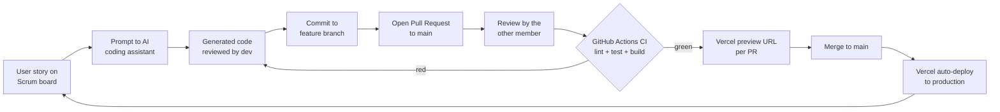

# Real-Time Currency Converter

| Field | Detail |
|---|---|
| **Title** | Real-Time Currency Converter |
| **Subtitle** | Vibe Coding & CI/CD |
| **Course** | Engenharia da Computação Gráfica e Multimédia (ECGM) |
| **Curricular Unit** | Engenharia de Software (EDS) — Activity: "Vibe Coding e CI/CD" |
| **Institution** | IPVC — Escola Superior de Tecnologia e Gestão (ESTG) |
| **Professor** | Vasco Nuno Miranda |
| **Academic Year** | 2025/2026 — 2nd Semester |
| **Authors** | Mateusz (`mtroc6`) and Hubert Stocki (`Rastji`) |
| **Date** | June 2026 |

---

## Table of Contents

> Note: This list is maintained manually for the Markdown source. In a Word document it would be generated automatically from the heading styles (References → Table of Contents), so page numbers and entries stay in sync with the document.

- 1. Introduction
- 2. Theme and Solution
  - 2.1. Solution Description
  - 2.2. Value Generated
  - 2.3. Development Process Architecture
- 3. Chosen Platform and Limitations
  - 3.1. Tools and Rationale
  - 3.2. Advantages and Difficulties
  - 3.3. Example Prompts Used
  - 3.4. Platform and CI/CD Limitations
- 4. GitHub, Agile and CI/CD
  - 4.1. Version Control and Collaboration
  - 4.2. Agile Management (Scrum on GitHub Projects)
  - 4.3. Task Distribution
  - 4.4. Product Backlog
  - 4.5. Continuous Integration (GitHub Actions)
  - 4.6. Continuous Deployment (Vercel)
- 5. Screenshots and Evidence
- 6. Conclusion and Critical Analysis
- 7. References
- 8. Links

---

## 1. Introduction

This report documents the development of a small but fully functional web application — a **real-time currency converter** — produced for the curricular unit *Engenharia de Software* (EDS) at IPVC-ESTG, within the activity "Vibe Coding e CI/CD". The work was carried out by a group of two Erasmus students, Mateusz (`mtroc6`) and Hubert Stocki (`Rastji`), and is therefore written in English.

The objective of the activity was not primarily to build a complex piece of software, but to **exercise and reflect on a modern software-engineering workflow**. Specifically, the assignment asked us to: (a) build a working prototype with the assistance of an AI coding assistant ("vibe coding"); (b) use GitHub for version control and collaboration; (c) manage the work using an Agile/Scrum board; and (d) set up an automated CI/CD pipeline that deploys the application online. We deliberately chose a modest, well-defined problem — converting an amount of money from one currency to another using live exchange rates — precisely so that the engineering *process* could be the focus rather than feature richness.

**What is "vibe coding"?** The term, popularised in early 2025, describes a style of development in which the programmer expresses intent in natural language to an AI model and iterates on the generated code, rather than writing every line by hand. The developer's role shifts toward specifying requirements, reviewing output, integrating pieces, and correcting the model when it goes wrong. It is a fast and accessible way to prototype, but — as this report discusses critically — it does not remove the need for engineering judgement, testing, or review.

The remainder of the report is structured as follows. Section 2 describes the chosen theme, the value the solution generates, and the architecture of our development process. Section 3 explains the tools we selected and why, including concrete example prompts and an honest account of limitations. Section 4 presents the evidence of our use of GitHub, the Scrum board, and the CI/CD pipeline. Section 5 lists the supporting screenshots. Section 6 offers a critical reflection on the process, the real potential and limits of AI, and the impact of collaboration and automation. Sections 7 and 8 contain the references and the links to the repository and the deployed application.

---

## 2. Theme and Solution

### 2.1. Solution Description

The application is a **real-time currency converter** that runs in the browser. The user selects a source currency and a target currency from lists populated dynamically from the exchange-rate provider, enters an amount, and immediately sees the converted value together with the exchange rate used and the date on which that rate was last published. Supporting features include a **swap button** (to exchange source and target with a single click), explicit **loading and error states**, and validation that prevents nonsensical conversions such as a currency to itself.

Exchange-rate data comes from the **Frankfurter API** (`api.frankfurter.dev/v1`), a free, open service that republishes the reference rates of the European Central Bank (ECB). It requires no API key and serves CORS-enabled responses, which makes it well suited to a client-side prototype. The list of available currencies is retrieved from the `/v1/currencies` endpoint, and the rates from the `/v1/latest` endpoint.

The front end is built with **Next.js 16** (App Router) and **TypeScript**, styled with **Tailwind CSS**. The conversion logic is deliberately separated into small, pure functions so that it can be unit-tested in isolation:

- `convert(amount, rate)` returns `amount * rate`;
- `roundTo(value, decimals)` performs deterministic rounding;
- `formatCurrency(value, currency)` formats the output for display;
- `isSameCurrency(a, b)` guards against converting a currency into itself;
- a parser that turns the raw API response into the typed shape the UI consumes.

This separation between *pure logic* (testable, deterministic) and *side-effecting UI/network code* is the single most important design decision in the project, and it is what makes the unit-testing and CI parts of the assignment meaningful rather than cosmetic.

### 2.2. Value Generated

The value of the converter is twofold. For an end user it is a **genuinely useful, no-friction tool**: there is no sign-up, no installation, no advertising, and the rates come from an authoritative source (the ECB via Frankfurter). For us as students it provided a problem that is small enough to finish inside one sprint yet realistic enough to require every element of the assignment — an external API with real failure modes, logic worth testing, UI states worth handling, and bugs worth tracking. In other words, the simplicity of the domain was itself a deliberate engineering choice: it let us invest our effort in the **process** (AI-assisted development, Agile management, and CI/CD) instead of fighting accidental complexity.

### 2.3. Development Process Architecture

Our workflow connects four moving parts — an AI coding assistant, GitHub, a CI pipeline, and a CD platform — into a single loop:

1. **AI generation.** Work begins from a user story on the Scrum board. The relevant team member writes a natural-language prompt to the AI coding assistant describing the desired behaviour. The AI produces code (a component, a pure function, a test file), which the developer reviews and adjusts.
2. **Versioning on GitHub.** The accepted code is committed to a **feature branch** (one branch per user story or bug), keeping `main` always releasable.
3. **Pull Request and review.** The author opens a **Pull Request** targeting `main`. The *other* team member reviews it — reading the diff, leaving comments, and requesting changes when needed. This human review is where most AI mistakes are caught.
4. **Continuous Integration.** Opening or updating the PR triggers a **GitHub Actions** workflow that runs ESLint, the Vitest unit tests, and a production build. The PR cannot be merged with a red pipeline.
5. **Continuous Deployment.** Vercel is connected to the repository: **every PR gets a unique preview URL** for manual inspection, and **every merge to `main` is automatically deployed to production**.

The loop then repeats for the next backlog item. The diagram below summarises the flow.

---

## 3. Chosen Platform and Limitations

### 3.1. Tools and Rationale

| Tool | Role | Why we chose it |
|---|---|---|
| **AI coding assistant (Claude)** | Generates code, tests, and explanations from prompts | Core of the "vibe coding" requirement; fast prototyping and good at idiomatic TypeScript/React |
| **Next.js 16 (App Router)** | React framework for the UI | First-class TypeScript support, simple deployment, and the natural pairing with Vercel |
| **TypeScript (strict)** | Language | Static types catch a class of AI-introduced mistakes at compile time |
| **Tailwind CSS** | Styling | Lets us style quickly inline without context-switching to CSS files; easy for AI to generate |
| **Frankfurter API** | Exchange-rate data | Free, no API key, CORS-open, ECB-backed; removes secret management from the prototype |
| **Vitest** | Unit testing | Fast, Vite-native, Jest-compatible API; ideal for testing the pure conversion logic |
| **ESLint (flat config)** | Static analysis | Enforces consistency and flags issues in AI-generated code |
| **GitHub + GitHub Projects** | Versioning, collaboration, Scrum board | Required by the assignment; integrates tightly with Actions and Vercel |
| **GitHub Actions** | Continuous Integration | Native to GitHub, no extra account; easy to gate PRs on lint/test/build |
| **Vercel** | Continuous Deployment | Zero-config deploys for Next.js, automatic preview URLs per PR, production on `main` |

### 3.2. Advantages and Difficulties

**Advantages.** The AI assistant dramatically shortened the time from idea to working code, especially for boilerplate (the fetch layer, the Tailwind markup, the first draft of the unit tests). The Next.js + Vercel + GitHub combination is almost frictionless: connecting the repository to Vercel took minutes and gave us preview deployments for free. Because the conversion logic was pure, writing meaningful tests was straightforward, and the green/red signal from CI gave both members confidence to merge.

**Difficulties.** The AI occasionally produced code that *looked* correct but was subtly wrong — for instance, rounding the result before formatting in a way that lost precision (this became BUG-01), or assuming the API returned a field that it did not. It also sometimes reached for slightly outdated patterns (older Next.js conventions, deprecated options), which we had to correct. On the tooling side, aligning ESLint's flat config with Next.js and TypeScript required a few iterations, and Vercel's handling of preview deployments for pull requests from forks needed manual authorisation.

### 3.3. Example Prompts Used

The following are representative of the prompts we actually used during development (lightly cleaned up). They illustrate the progression from scaffolding, to features, to tests, to bug-fixing.

1. *"Create a Next.js 16 App Router page in TypeScript with a currency converter UI: two dropdowns for source and target currency, a number input for the amount, and a result area. Use Tailwind for styling. Don't fetch anything yet — just static placeholder data and the layout."*

2. *"Write a pure TypeScript module `lib/convert.ts` with these functions: `convert(amount, rate)`, `roundTo(value, decimals)`, `formatCurrency(value, currency)` using Intl.NumberFormat, and `isSameCurrency(a, b)`. No React, no side effects, fully typed."*

3. *"Add a fetch layer that calls `https://api.frankfurter.dev/v1/currencies` to populate the dropdowns and `https://api.frankfurter.dev/v1/latest?base=USD&symbols=EUR` to get a rate. Handle loading and error states and show the last-update date from the response."*

4. *"Write Vitest unit tests for `lib/convert.ts`. Cover normal conversion, zero amount, rounding to 2 decimals, formatting different currencies, and the same-currency guard returning true/false correctly."*

5. *"There's a bug (BUG-01): the converted result shows up to 6 decimal places. The amount should be rounded to 2 decimals only for display, without losing precision in the underlying value. Fix `formatCurrency`/`roundTo` and add a regression test."*

6. *"Add a swap button that exchanges the source and target currencies and re-runs the conversion. Disable the convert action and show a message when both currencies are the same (BUG-02)."*

A recurring lesson was that **precise, constrained prompts** (naming files, listing exact function signatures, stating what *not* to do) produced far better results than open-ended requests.

### 3.4. Platform and CI/CD Limitations

We want to be honest about the limits of this stack:

- **Data freshness.** The Frankfurter/ECB rates update only **once per business day** (around 16:00 CET) and not at all on weekends or holidays. The application is therefore "real-time" only in the sense of fetching the *latest published* rate; it cannot show intraday market movements. The label "last updated" date is important for setting correct user expectations.
- **Single external dependency.** The app relies entirely on one free third-party service. If Frankfurter is down or rate-limited, the converter cannot function — a single point of failure with no fallback provider in this prototype.
- **AI reliability.** As noted, the assistant can introduce bugs, code smells, or outdated API usage. It has no awareness of our test results unless we feed them back, so it cannot self-verify. Human review and the CI gate are essential compensating controls.
- **CI/CD constraints.** Preview deployments for **fork-based pull requests require manual authorisation** on Vercel for security reasons, which slightly interrupts the otherwise automatic flow. The **Vercel Hobby (free) plan** also imposes limits on build minutes, bandwidth, and concurrency, and forbids commercial use — acceptable for a student project but not for production at scale. GitHub Actions free minutes are likewise finite.

---

## 4. GitHub, Agile and CI/CD

### 4.1. Version Control and Collaboration

The project lives in a single GitHub repository (https://github.com/mtroc6/currency-converter). We followed a **feature-branch workflow**: `main` is protected and always deployable, and each user story or bug is developed on its own branch (e.g. `feat/us-01-currency-picker`, `fix/bug-01-decimals`). Both members contributed commits and both opened and reviewed Pull Requests, so the collaboration is visible in the repository's history rather than asserted. Every PR was reviewed by the member who did *not* author it before being merged, which gave us a real four-eyes check on AI-generated code (see Figure 2).

### 4.2. Agile Management (Scrum on GitHub Projects)

We managed the work as a lightweight **Scrum** process on a **GitHub Projects** board with the columns *Product Backlog → In Progress → Done*. Each user story and bug is a GitHub Issue, linked to the board and to the branch/PR that implements it. We ran **one complete sprint** covering the core converter functionality. Bugs found during the sprint were filed as issues (BUG-01, BUG-02), assigned, fixed on dedicated branches, and closed via their PRs — demonstrating issue/bug management as part of the flow (see Figure 1).

### 4.3. Task Distribution

| Member | Responsibilities |
|---|---|
| **Mateusz (`mtroc6`)** | Project scaffold; US-02 (enter amount & see result); US-04 (swap button); US-05 (show rate + date); US-06 (loading/error states); CI pipeline (GitHub Actions); BUG-01 & BUG-02 (rounding & same-currency, handled in the converter) |
| **Hubert Stocki (`Rastji`)** | US-01 (pick currencies); US-03 (fetch rates from API); unit tests (Vitest); report & documentation; pull-request reviews |

### 4.4. Product Backlog

The table below shows the full Product Backlog with the items completed in Sprint 1 and the items deferred to a future sprint.

| ID | Type | Description | Sprint | Status |
|---|---|---|---|---|
| US-01 | Story | As a user, I can pick a source and target currency from a list | Sprint 1 | Done |
| US-02 | Story | As a user, I can enter an amount and see the converted result | Sprint 1 | Done |
| US-03 | Story | As a user, the app fetches current rates from the API | Sprint 1 | Done |
| US-04 | Story | As a user, I can swap source and target with one button | Sprint 1 | Done |
| US-05 | Story | As a user, I can see the rate used and its last-update date | Sprint 1 | Done |
| US-06 | Story | As a user, I see clear loading and error states | Sprint 1 | Done |
| BUG-01 | Bug | Result shows too many decimal places | Sprint 1 | Done |
| BUG-02 | Bug | Conversion allowed with the same currency on both sides | Sprint 1 | Done |
| US-07 | Story | As a user, I can see a history of my conversions (localStorage) | Backlog | To Do |
| US-08 | Story | As a user, I can view a historical rate chart | Backlog | To Do |
| US-09 | Story | As a user, I can switch to dark mode | Backlog | To Do |

### 4.5. Continuous Integration (GitHub Actions)

A workflow defined in `.github/workflows/ci.yml` runs on every push and pull request. It checks out the code, sets up Node.js, installs dependencies, and then runs three gates in sequence:

1. **Lint** — `eslint` over the codebase (flat config);
2. **Test** — `vitest run` for the pure-logic unit tests;
3. **Build** — `next build` to confirm the application compiles and type-checks.

If any step fails, the run is red and the PR is blocked from merging (see Figure 3). This guarantees that no broken or untested code reaches `main`, and it is also where AI-introduced regressions (such as the original BUG-01 before its fix) would be caught when covered by a test.

### 4.6. Continuous Deployment (Vercel)

Vercel is connected directly to the GitHub repository, providing zero-configuration **Continuous Deployment** for the Next.js app:

- **Preview deployments:** every Pull Request automatically builds and is published to a unique preview URL, so a reviewer can click through the actual running change before approving (see Figures 4 and 5).
- **Production deployments:** every merge to `main` triggers an automatic production deploy to the public URL (https://currency-converter-usluginajuz.vercel.app).

Because Vercel waits on the build and the CI checks are required on the PR, a change must be both *green in CI* and *successfully built by Vercel* before it can reach users.

---

## 5. Screenshots and Evidence

The following figures are referenced throughout the report and should be inserted in the final PDF.

- **Figure 1 — Scrum board.** The GitHub Projects board showing the Product Backlog, the Sprint Backlog, and the *Done* column for the completed Sprint 1, including the two closed bug issues. *(insert screenshot: GitHub Projects board with columns and cards)*
- **Figure 2 — Pull Request with review.** An open/merged PR showing the diff, a review comment from the other team member, and an approval. *(insert screenshot: PR "Files changed" / "Conversation" tab with review)*
- **Figure 3 — Green CI run.** A successful GitHub Actions run showing the lint, test, and build jobs all passing. *(insert screenshot: GitHub Actions run summary, all checks green)*
- **Figure 4 — Vercel deployment.** The Vercel dashboard showing the production deployment from `main`. *(insert screenshot: Vercel project deployments list)*
- **Figure 5 — PR preview URL.** The Vercel preview-deployment comment/link on a Pull Request. *(insert screenshot: PR with Vercel bot preview URL)*
- **Figure 6 — The running application.** The deployed converter performing a conversion, showing the rate and last-update date. *(insert screenshot: live app with a EUR→USD conversion)*
- **Figure 7 — Error/loading state.** The application displaying a loading indicator and/or an error message. *(insert screenshot: app in loading or error state)*

---

## 6. Conclusion and Critical Analysis

**On the process and methodologies.** Working within a Scrum frame, even at this small scale, gave the project a clear rhythm: every piece of work started as a user story, lived on a branch, passed through review and CI, and ended in a deploy. The discipline of "one issue, one branch, one PR" made progress visible and made it natural to split the work between two people without stepping on each other. Sprinting around a deliberately small backlog meant we actually *finished* a sprint, which is more instructive than half-completing an ambitious one.

**On the real potential and limits of AI.** The AI assistant was genuinely effective for generating boilerplate, drafting tests, and proposing fixes — it compressed hours of typing into minutes and lowered the barrier to using an unfamiliar framework. However, the experience also exposed its limits clearly. The model produced confident but incorrect code on several occasions (the decimal-precision bug being the clearest case), occasionally relied on outdated API patterns, and could not verify its own output against our tests. It is best understood as a fast, knowledgeable, but **unreliable collaborator** whose work must always be reviewed. The combination that worked was *AI for speed, types and tests for correctness, and human review for judgement* — none of the three alone would have been sufficient.

**On limitations encountered.** Beyond AI reliability, the most real limitations were external: the once-per-day ECB data means the app is not truly intraday, and the dependence on a single free API is a genuine single point of failure. On the platform side, fork-PR preview authorisation and free-tier quotas (Vercel Hobby, GitHub Actions minutes) are minor frictions that would matter more at scale.

**On collaborative work.** Mandating that each PR be reviewed by the *other* member turned review from a formality into the project's main quality mechanism. It spread knowledge across the team (neither member was the sole owner of any area), surfaced bugs early, and forced clearer commit and PR descriptions. The cost — waiting for a review before merging — was small and clearly worth it.

**On the impact of CI/CD.** Automating lint, test, and build on every PR changed how we felt about merging: a green check was a concrete, trustworthy signal rather than a hope. Coupled with Vercel's preview URLs, every change could be *seen running* before approval and was *live within a minute* of merging. This tightened the feedback loop dramatically and is, in our view, the single practice from this project most worth carrying into future work. The main caveat is that CI/CD only protects what is actually tested — the pipeline is exactly as good as the test suite behind it, which again places the responsibility back on the engineers, not the automation.

In summary, the project met all of its objectives: a working, deployed prototype, built with AI assistance, versioned and managed collaboratively on GitHub with Scrum, and protected by an automated CI/CD pipeline. More valuable than the converter itself was the confirmation that AI accelerates development but does not replace engineering discipline — testing, review, and automation remain what make the difference between code that runs and software that can be trusted.

---

## 7. References

GitHub. (n.d.). *GitHub Actions documentation*. GitHub Docs. Retrieved June 18, 2026, from https://docs.github.com/en/actions

GitHub. (n.d.). *Planning and tracking with Projects*. GitHub Docs. Retrieved June 18, 2026, from https://docs.github.com/en/issues/planning-and-tracking-with-projects

Frankfurter. (n.d.). *Frankfurter — Exchange rates API*. Retrieved June 18, 2026, from https://frankfurter.dev/

Anthropic. (2026). *Claude* [Large language model, AI coding assistant]. https://www.anthropic.com/claude

Microsoft. (n.d.). *TypeScript documentation*. Retrieved June 18, 2026, from https://www.typescriptlang.org/docs/

Tailwind Labs. (n.d.). *Tailwind CSS documentation*. Retrieved June 18, 2026, from https://tailwindcss.com/docs

Vercel. (n.d.). *Next.js documentation*. Retrieved June 18, 2026, from https://nextjs.org/docs

Vercel. (n.d.). *Vercel documentation: Deployments and Git integration*. Retrieved June 18, 2026, from https://vercel.com/docs

Vitest. (n.d.). *Vitest — Next generation testing framework*. Retrieved June 18, 2026, from https://vitest.dev/

---

## 8. Links

- **Repository (GitHub):** https://github.com/mtroc6/currency-converter
- **Application (production, Vercel):** https://currency-converter-usluginajuz.vercel.app